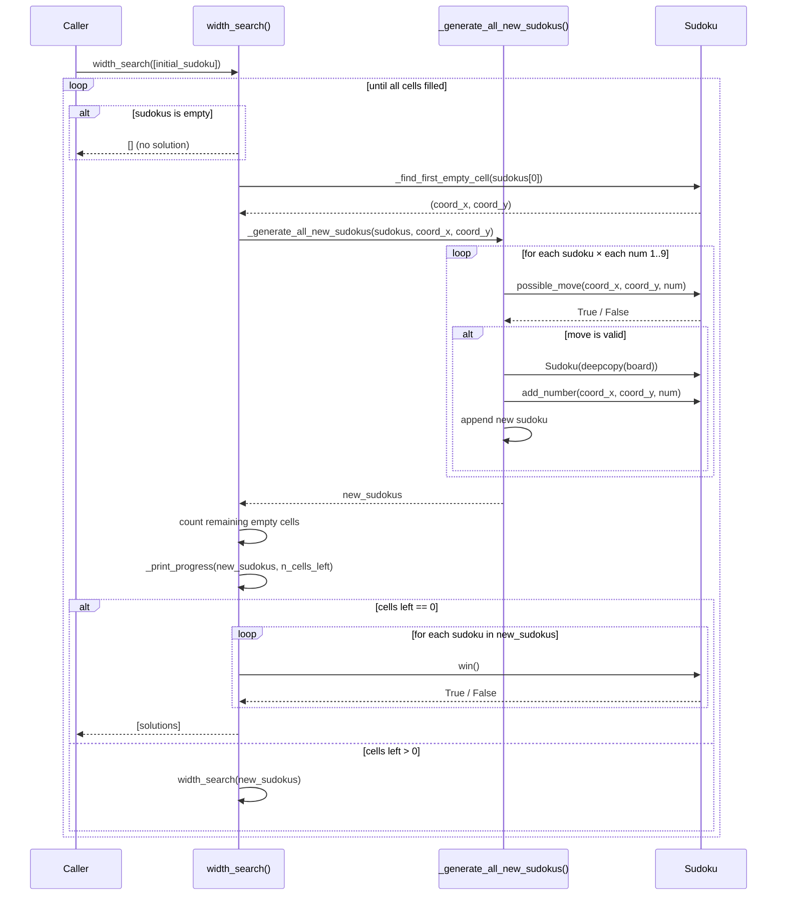

# Sudoku Solver

Solves Sudoku puzzles using a **width search** (breadth-first) algorithm. Given a board with empty cells (represented as `0`), it explores all valid number placements level by level until a solution is found.

## How it works

At each step, the algorithm:
1. Finds the first empty cell on the board.
2. Tries every number from 1 to 9, skipping those that violate Sudoku rules (duplicate in row, column, or 3×3 square).
3. For each valid number, creates a new board with that number placed and recurses.
4. Returns all boards where every cell is correctly filled.

## Sequence diagram



## Project structure

```
src/
├── sudoku.py       # Sudoku class: board representation and validation logic
├── width_search.py # Width search (breadth-first) algorithm
└── examples.py     # Ready-to-run examples (easy, medium, hard)
```

## Usage

Run the example script:

```bash
uv run python -m src.examples
```

To change the difficulty, edit the `difficulty` variable in `src/examples.py`:

```python
difficulty: Literal["easy", "medium", "hard"] = "easy"
```

Note that you can also include your own Sudokus!
